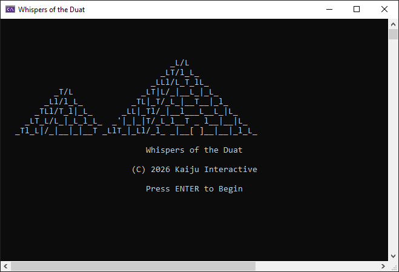
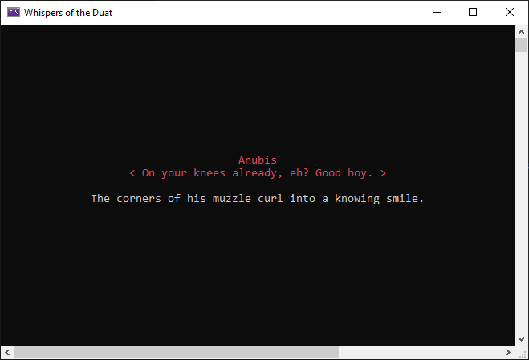

# 🏺 Whispers of the Duat

**A choice-driven romance beneath the gaze of the gods.**

Whispers of the Duat is an Ancient Egyptian romance and interactive fiction game developed in C++ by Kaiju Interactive.

You play as a temple priest whose encounters with the gods begin to become increasingly personal. Your choices shape your personality, your relationships, and which god you may ultimately grow closest to.

> **Status:** Playable demo released on itch.io

## 🐺 The Gods

### Anubis
God of the dead and guide to the afterlife.

### Set
God of storms, chaos, and disorder.

### Horus
God associated with kingship and the sky.

### Sobek
The powerful crocodile god associated with the Nile.

## 🎭 Choice System

Choices can affect both the protagonist's personality and relationships throughout the story.

Current personality traits include:

- Shyness
- Confidence
- Honesty

Each romanceable character also has an independent affection value, allowing choices and interactions to influence individual relationships.

## ✨ Features

- Branching narrative
- Multiple romance interests
- Player-driven dialogue choices
- Personality tracking
- Character affection system
- Multiple scenes and locations
- Color-coded character dialogue
- Ancient Egyptian setting
- Built entirely in C++

## 📸 Screenshots

*Enter the Duat.*

*Your interactions with the gods may become... personal.*

## 🎮 Play the Demo

The current demo is available on itch.io.

[Play Whispers of the Duat – DEMO](https://kaiju-plays.itch.io/whispers-of-the-duat)

## 🚧 Development Status

Whispers of the Duat is currently in development.

The available demo represents an early portion of the story, with additional scenes, character interactions, choices, and relationship development planned.

## 🛠️ Built With

- C++
- Visual Studio
- Windows Console

---

Developed by **Kaiju Interactive**.
